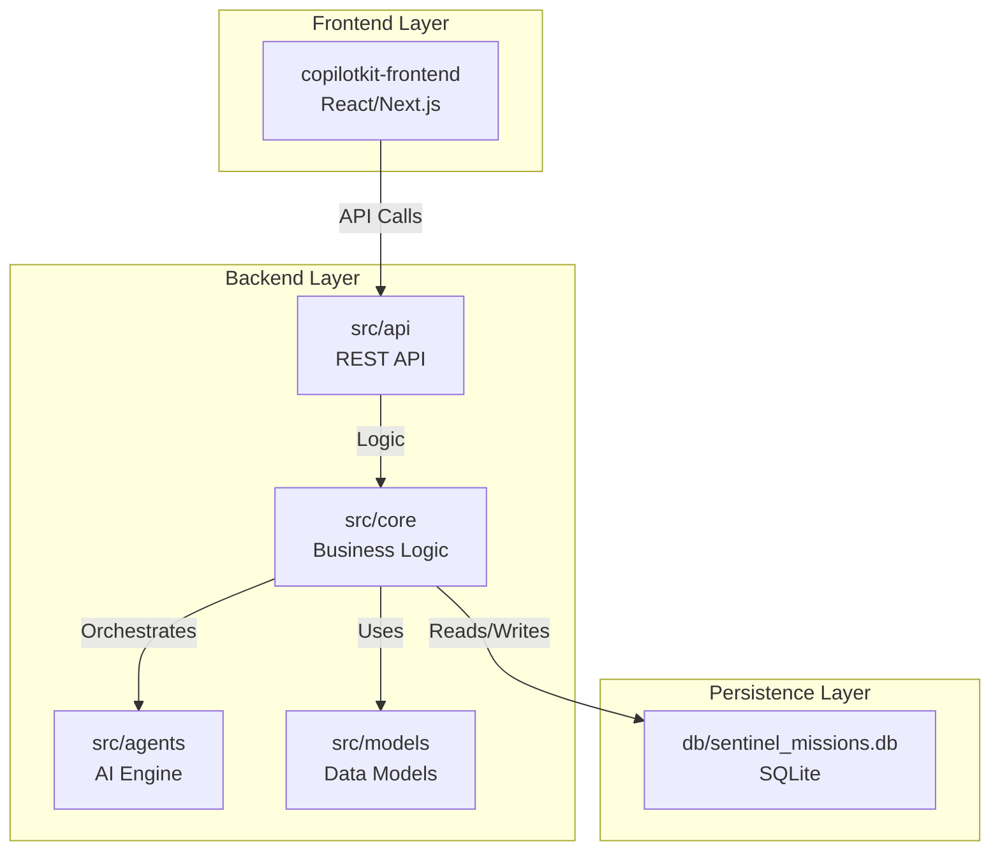
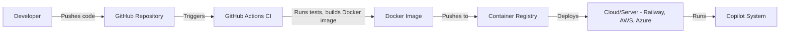

# 🚀 COPILOT SYSTEM: FULL ARCHITECTURE & DIRECTORY OVERVIEW

---

copilot/
│
copilot/
│
## System Directory Structure Overview

```
copilot/
│
├── .env                        # Main environment variables for backend (API keys, DB URLs, etc.)
├── .git/                       # Git version control data
├── .gitignore                  # Specifies files/folders to ignore in Git
├── .vscode/                    # VS Code workspace settings
├── COPILOTKIT_SYSTEM_OVERVIEW.md # This system overview and documentation file
├── README.md                   # Main project documentation and onboarding guide
├── SETUP_GUIDE.md              # Step-by-step setup instructions for the system
├── manage_services.py          # Python script to automate starting/stopping backend/frontend services
├── move_desktop_app_to_root.ps1 # PowerShell script for moving desktop app files
├── requirements.txt            # Python package dependencies for backend
├── runtime-references.txt      # Notes and references for runtime configuration
├── setup.cfg                   # Python packaging configuration
│
├── copilotkit-frontend/        # Modern React SPA frontend (CopilotKit UI)
│   ├── .env                    # Frontend environment variables (API keys, config)
│   ├── build/                  # Production build output (auto-generated)
│   ├── LICENSE                 # Project license (MIT)
│   ├── node_modules/           # Installed frontend dependencies (auto-generated)
│   ├── package.json            # Frontend dependencies, scripts, and metadata
│   ├── public/                 # Static assets for frontend
│   │   ├── favicon.ico         # App favicon
│   │   ├── index.html          # Main HTML file
│   │   ├── manifest.json       # Web app manifest
│   │   └── robots.txt          # Robots exclusion file
│   ├── README.md               # Frontend-specific documentation
│   ├── src/                    # Main frontend source code
│   │   ├── App.js              # Main React app entry point
│   │   ├── App.jsx             # Alternate React app entry point
│   │   ├── googleGenAIAdapter.js # Adapter for Google Generative AI integration
│   │   ├── index.css           # Global styles
│   │   ├── index.js            # React entry point
│   │   ├── setupProxy.js       # Proxy configuration for local API requests
│   │   ├── components/         # Reusable React UI components
│   │   │   ├── AdvancedAgentPanel.js      # Advanced agent dashboard panel
│   │   │   ├── AgenticTaskExecutor.js     # UI for agentic task execution
│   │   │   ├── AnalyticsCharts.js         # Analytics chart components
│   │   │   ├── CopilotAgent.jsx           # Main Copilot agent logic and UI
│   │   │   ├── CopilotAgentPanel.js       # Panel for Copilot agent controls
│   │   │   ├── CopilotChat.js             # Chat UI component (custom or placeholder)
│   │   │   ├── CopilotMissionChat.js      # Mission-specific chat UI
│   │   │   ├── DashboardWidgets.js        # Dashboard widget components
│   │   │   ├── ErrorBoundary.js           # Error boundary for React error handling
│   │   │   ├── KeyboardNavigation.js      # Keyboard navigation logic
│   │   │   ├── MissionList.js             # Mission list UI
│   │   │   ├── MissionModal.js            # Modal for mission details
│   │   │   ├── NavBar.js                  # Navigation bar UI
│   │   │   ├── Notification.js            # Notification system UI
│   │   │   ├── SentinelInitializer.js     # Initialization logic for Sentinel frontend
│   │   │   ├── SettingsPanel.js           # Settings panel UI
│   │   │   ├── ThemeProvider.js           # Theme/context provider for UI
│   │   ├── context/            # React context providers
│   │   │   └── SentinelContext.js         # Global Sentinel context provider
│   │   ├── hooks/              # Custom React hooks
│   │   │   ├── useNotification.js         # Hook for notifications
│   │   │   └── useRealtime.js             # Hook for real-time updates
│   │   ├── pages/              # Page-level React components
│   │   │   ├── AgenticGenerativeUI.js     # Agentic generative UI page (CopilotKit agentic chat)
│   │   │   ├── Analytics.js               # Analytics dashboard page
│   │   │   ├── Dashboard.js               # Main dashboard page
│   │   │   ├── Missions.js                # Missions dashboard page
│   │   │   ├── NotFound.js                # 404 error page
│   │   │   ├── Settings.js                # Settings page
│   │   ├── styles/              # CSS stylesheets
│   │   │   └── agentic.css               # Styles for agentic generative UI
│   │   ├── utils/               # Utility functions for frontend
│   │   │   ├── api.js                   # API call utilities
│   │   │   ├── index.js                 # General frontend utilities
│   │   │   ├── llm.js                   # LLM integration utilities
│   │   │   └── realtime.js              # Real-time update utilities
│   │   ├── views/               # High-level UI views/screens
│   │   │   ├── Analytics.jsx            # Analytics view
│   │   │   ├── Dashboard.jsx            # Dashboard view
│   │   │   ├── Missions.jsx             # Missions view
│   │   │   ├── Settings.jsx             # Settings view
│   │   │   └── TestMissions.jsx         # Test missions view
│   ├── yarn.lock                # Yarn lockfile for dependency management
│
├── db/                         # Local database files for agent memory
│   └── chroma_memory/          # ChromaDB vector database files for agent memory
│       ├── chroma.sqlite3      # Main ChromaDB SQLite file
│       └── a71a6ad9-eb43-41a4-b61f-877454df2314/ # ChromaDB binary data directory
│
├── desktop-app/                # Desktop app scripts
│   └── clean_copilotkit_workspace.ps1   # PowerShell script to clean workspace for desktop app
│
├── src/                        # Python backend source code
│   ├── __init__.py             # Python package marker
│   ├── cognitive_engine_service.py      # Core cognitive engine logic
│   ├── main.py                 # Backend entry point (FastAPI)
│   ├── README_WebSocket_Fixes.md        # Notes/fixes for WebSocket issues
│   ├── agents/                 # AI agent logic and mission execution
│   │   ├── __init__.py                 # Agents package marker
│   │   ├── advanced_agents.py          # Advanced agent logic
│   │   ├── ai_task_parser.py           # AI task parsing logic
│   │   ├── executable_agent.py         # Executable agent logic
│   │   ├── real_mission_executor.py    # Mission execution logic
│   │   ├── simple_executable_agent.py  # Simple agent logic
│   │   ├── specialized_agents.py       # Specialized agent logic
│   ├── api/                    # API endpoint definitions
│   │   ├── __init__.py                 # API package marker
│   │   └── copilotkit.py               # CopilotKit API integration
│   ├── config/                 # System configuration modules
│   │   ├── __init__.py                 # Config package marker
│   │   └── settings.py                 # System settings/configuration
│   ├── core/                   # Core business logic and workflow engines
│   │   ├── __init__.py                 # Core package marker
│   │   ├── advanced_intelligence.py    # Advanced intelligence logic
│   │   ├── blueprint_tasks.py          # Task blueprint logic
│   │   ├── cognitive_forge_engine.py   # Cognitive forge engine logic
│   │   ├── enhanced_cognitive_forge_engine.py # Enhanced cognitive forge engine logic
│   │   ├── execution_workflow.py       # Workflow execution logic
│   │   ├── hybrid_decision_engine.py   # Hybrid decision engine logic
│   │   ├── real_mission_executor.py    # Mission execution logic
│   │   ├── sandbox_executor.py         # Sandbox execution logic
│   │   ├── sentinel_multi_agent_integration.py # Multi-agent integration logic
│   │   ├── supercharged_optimizer.py   # Optimizer logic
│   │   ├── supercharged_websocket_manager.py # WebSocket manager logic
│   ├── models/                 # Data models and DB logic
│   │   ├── __init__.py                 # Models package marker
│   │   ├── advanced_database.py        # Advanced database logic
│   │   ├── fix_database_schema.py      # Database schema fixes
│   │   ├── fix_railway_database.py     # Railway DB fixes
│   ├── tools/                  # Tools and utilities for agents
│   │   ├── __init__.py                 # Tools package marker
│   │   ├── advanced_tools.py           # Advanced tools for agents
│   │   ├── file_system_tools.py        # File system utilities
│   │   ├── simple_file_system_tools.py # Simple file system tools
│   │   ├── specialized_tools.py        # Specialized agent tools
│   └── utils/                  # General backend utilities
│       ├── __init__.py                 # Utils package marker
│       ├── agent_observability.py      # Observability utilities
│       ├── auto_fix.py                 # Automated fix logic
│       ├── automated_debugger.py       # Automated debugging logic
│       ├── crewai_bypass.py            # CrewAI bypass logic
│       ├── debug_killer.py             # Debugging utilities
│       ├── debug_logger.py             # Debug logger
│       ├── fix_ai.py                   # AI fix logic
│       ├── google_ai_wrapper.py        # Google AI integration
│       ├── guardian_protocol.py        # Guardian protocol logic
│       ├── json_parser.py              # JSON parsing utilities
│       ├── litellm_custom_provider.py  # LiteLLM provider logic
│       ├── llm_patch.py                # LLM patch logic
│       ├── log_collector.py            # Log collection utilities
│       ├── manage_services.py          # Service management utilities
│       ├── onnxruntime_fix.py          # ONNX runtime fix logic
│       ├── performance_optimizer.py    # Performance optimization logic
│       ├── phoenix_protocol.py         # Phoenix protocol logic
│       ├── self_learning_module.py     # Self-learning module logic
│       ├── sentry_api_client.py        # Sentry API client
│       ├── sentry_integration.py       # Sentry integration logic
│       ├── synapse_logging.py          # Synapse logging utilities
│       ├── system_cheatsheet.txt       # System cheatsheet
│
├── logs/                      # (Empty or runtime logs generated during operation)
│
└── agentic_generative_ui/     # (legacy, now removed from main system)
    ├── agent.py               # Legacy agentic generative UI backend logic
    ├── page.tsx               # Legacy agentic generative UI frontend logic
    ├── README.md              # Legacy agentic generative UI documentation
    └── style.css              # Legacy agentic generative UI styles
```
├── scripts/                     # Automation and utility scripts
│   ├── apply_websocket_fix.py   # Applies patches for WebSocket issues
│   ├── check_websocket_health.py# Monitors WebSocket connection health
│   ├── fix_database_schema.py   # Migrates or repairs the DB schema
│   ├── integration_test.py      # Runs integration tests
│   ├── manage_services.py       # Script for managing system services
│   ├── monitor_websockets.py    # Real-time WebSocket monitoring tool
│   ├── start_sentinel.bat       # Windows batch script to start the system
│   ├── start_sentinel.ps1       # PowerShell script to start the system
│   ├── start_sentinel.py        # Python script to launch the system
│   └── test_websocket.py        # Utility for testing WebSocket connections
│
├── src/                         # Python backend source code
│   ├── __init__.py              # Makes 'src' a Python package
│   ├── cognitive_engine_service.py # Core service for the cognitive/AI engine
│   ├── main.py                  # Main entry point for the backend application (e.g., FastAPI/Flask)
│   ├── observability_manager.py # Manages logging, tracing, and metrics
│   ├── agents/                  # Logic for individual AI agents
│   ├── api/                     # API endpoint definitions (FastAPI/Flask routers)
│   ├── config/                  # Backend configuration modules
│   ├── core/                    # Core business logic and services
│   ├── models/                  # Data models (e.g., SQLAlchemy ORM models)
│   ├── tools/                   # Tools and utilities used by agents or services
│   └── utils/                   # General utility functions for the backend
│
├── static/                      # Static assets served by the backend (for simple HTML/Jinja2 frontends)
│   ├── css/                     # CSS files
│   ├── fonts/                   # Font files
│   ├── images/                  # Image files
│   └── js/                      # JavaScript files
│
├── templates/                   # HTML templates (e.g., Jinja2) for the simple frontend
│   ├── ai-agents.html           # Template for the AI agents dashboard
│   ├── analytics.html           # Template for the analytics dashboard
│   ├── index.html               # Main landing page template
│   ├── missions.html            # Template for the missions dashboard
│   ├── settings.html            # Template for the settings page
│   └── test-missions.html       # Template for testing missions
│
├── tests/                       # Automated tests for the backend
│
├── workspace/                   # Directory for temporary files, agent outputs, etc.
│
├── .env                         # Environment variables (API keys, DB connection strings) - NOT COMMITTED
├── CREWAI_LLM_FIX_SUMMARY.md    # Documentation for CrewAI LLM fixes
├── CRITICAL_FIXES_SUMMARY.md    # Summary of critical system fixes
├── Dockerfile                   # Configuration for building a Docker container
├── LLM_FIX_README.md            # README for LLM-related fixes
├── README.md                    # This file: System overview and documentation
├── SENTINEL_SYSTEM_OVERVIEW.md  # High-level overview of the Sentinel system
├── SENTINEL_V6_INTEGRATION_COMPLETE.md # Notes on Sentinel v6 integration
├── SETUP_GUIDE.md               # Instructions for setting up the system
├── WEBSOCKET_DIAGNOSTIC_TOOLS.md# Documentation for WebSocket diagnostic tools
├── WEBSOCKET_FIXES_SUMMARY.md   # Summary of WebSocket-related fixes
├── copilot-integration.txt      # Notes on Copilot integration
├── copilotkit-references.txt    # References for CopilotKit
├── mission_details.json         # Example or default mission details
├── multi_agent_config.toml      # Configuration for the multi-agent system
├── pyproject.toml               # Python project configuration (PEP 621)
├── railway.toml                 # Configuration for Railway deployments
├── requirements.txt             # Python dependencies
└── setup.cfg                    # Configuration for Python packaging tools (e.g., setuptools)
```

---

## 2. 🗂️ File & Directory Explanations (In-Depth)

### `copilotkit-frontend/`
> **Purpose:** This is the main, modern user interface for the system, built with React and Next.js. It leverages the CopilotKit framework for rich, AI-powered features.
> **How it Works:** It runs as a separate Node.js process, communicating with the Python backend via the API defined in `src/api/`. It handles all user interactions, dashboard displays, and real-time updates.

### `db/`
> **Purpose:** Contains all local database files. This is crucial for development and testing without needing a cloud database.
> - `sentinel_missions.db`: A simple SQLite database for storing mission data.
> - `chroma_memory/`: A ChromaDB vector database used by AI agents to store and retrieve memories (embeddings), enabling long-term context and learning.

### `logs/`
> **Purpose:** Stores all runtime logs from the application. Essential for debugging and monitoring system health.
> - `cognitive_engine.log`: Specific logs from the core AI decision-making services.
> - `debug.log`: General-purpose debug logs.

### `scripts/`
> **Purpose:** A collection of utility scripts for system management, maintenance, and testing.
> **How it Works:** These are standalone scripts (Python, PowerShell, Batch) that can be run from the command line to perform tasks like starting services, checking health, or applying fixes.

### `src/`
> **Purpose:** The heart of the Python backend. It contains all the core logic for the application.
> **How it Works:** It runs a web server (like FastAPI or Flask) that exposes a REST API, orchestrates AI agents, interacts with the database, and manages the core business logic of the system.
> - `main.py`: The entry point that starts the backend server.
> - `agents/`: Defines the behaviors and capabilities of different AI agents.
> - `api/`: Defines the REST API endpoints that the frontend consumes.
> - `core/`: Contains the central business logic and service managers.
> - `models/`: Defines the data structures (e.g., using SQLAlchemy) that map to database tables.

### `static/` & `templates/`
> **Purpose:** These directories support a simpler, server-side rendered frontend using a Python web framework like Flask or Django. The `static` folder holds assets (CSS, JS), and `templates` holds the HTML pages.
> **Note:** This is likely a simpler or older UI. The primary, modern UI is in `copilotkit-frontend/`.

### `tests/`
> **Purpose:** Contains all automated tests for the Python backend. This ensures code quality and prevents regressions.

### `workspace/`
> **Purpose:** A temporary storage area for agents. Agents can use this directory to store intermediate files, outputs, or logs for a specific task.

### Configuration Files (`.env`, `pyproject.toml`, `multi_agent_config.toml`)
> **Purpose:** These files control the behavior of the system.
> - `.env`: Stores secrets and environment-specific settings like API keys and database URLs. It is critical that this file is **not** committed to version control.
> - `pyproject.toml`: The standard configuration file for modern Python projects. It defines dependencies, project metadata, and tool settings.
> - `multi_agent_config.toml`: A custom configuration file for defining the settings and behaviors of the multi-agent system.

### Documentation (`.md`, `.txt` files)
> **Purpose:** A rich set of Markdown and text files that document the system's architecture, setup, and development history. This `README.md` is the central document.

---

## 3. 🧠 System Logic & Data Flow

### 3.1. **Frontend-Backend Interaction**

```mermaid
flowchart LR
    A[copilotkit-frontend (React/Next.js)] -- API Request (HTTP/REST) --> B[src/ (Python Backend) (FastAPI/Flask)]
    B -- Read/Write data --> C[db/ (Databases) (SQLite)]
    B -- API Response --> A
    B -- Orchestrate agent --> D[agents/, core/, tools/]
    D -- Read/Write data --> C
```
```

### 3.2. **Agent Memory Flow**

### 3.2. **Agent Memory Flow**

```mermaid
flowchart LR
    A[src/agents/ (Agent Logic)] --> B[src/tools/ (DB Tool)]
    B --> C[db/sentinel_missions.db (SQLite)]
```
```

---

## 4. 🖼️ Visual System Map

### 4. 🖼️ Visual System Map



---

### 4.1. 🛠️ CI/CD & Deployment Pipeline


```

---

## 5. 🛠️ Key Workflows

### 5.1. **Mission Execution**
1.  **Creation:** A user creates a new mission in the `copilotkit-frontend` UI.
2.  **API Call:** The frontend sends a request to the backend's `/api/missions` endpoint.
3.  **Storage:** The backend stores the new mission details in the `sentinel_missions.db`.
4.  **Orchestration:** The `cognitive_engine_service` picks up the mission and assigns it to an appropriate agent from `src/agents/`.
5.  **Execution:** The agent executes the task, using `src/tools/` and storing/retrieving information from `db/chroma_memory/` as needed.
6.  **Updates:** As the agent works, it sends status updates back through the backend, which are reflected in the real-time UI.
7.  **Completion:** Once the mission is complete, the final status is saved to the database.

----

## 6. 📚 Additional Notes & Insights
- **Dual Frontend:** The system appears to have two frontends: a modern, primary one in `copilotkit-frontend/` and a simpler, server-rendered one supported by `static/` and `templates/`. Understanding which one is active for development is key.
- **Configuration is King:** The system's behavior is heavily controlled by configuration files (`.env`, `.toml`). This makes it flexible but also requires careful management of settings.
- **Extensibility:** The architecture is highly modular. You can add new agents, tools, or API endpoints with minimal changes to the core system by adding files to the `src/agents`, `src/tools`, and `src/api` directories.
- **Security:** The use of a `.env` file is a good security practice. Ensure it is never committed to your Git repository. Any scripts that execute shell commands should be carefully audited to prevent security vulnerabilities.

---

# END OF OVERVIEW
