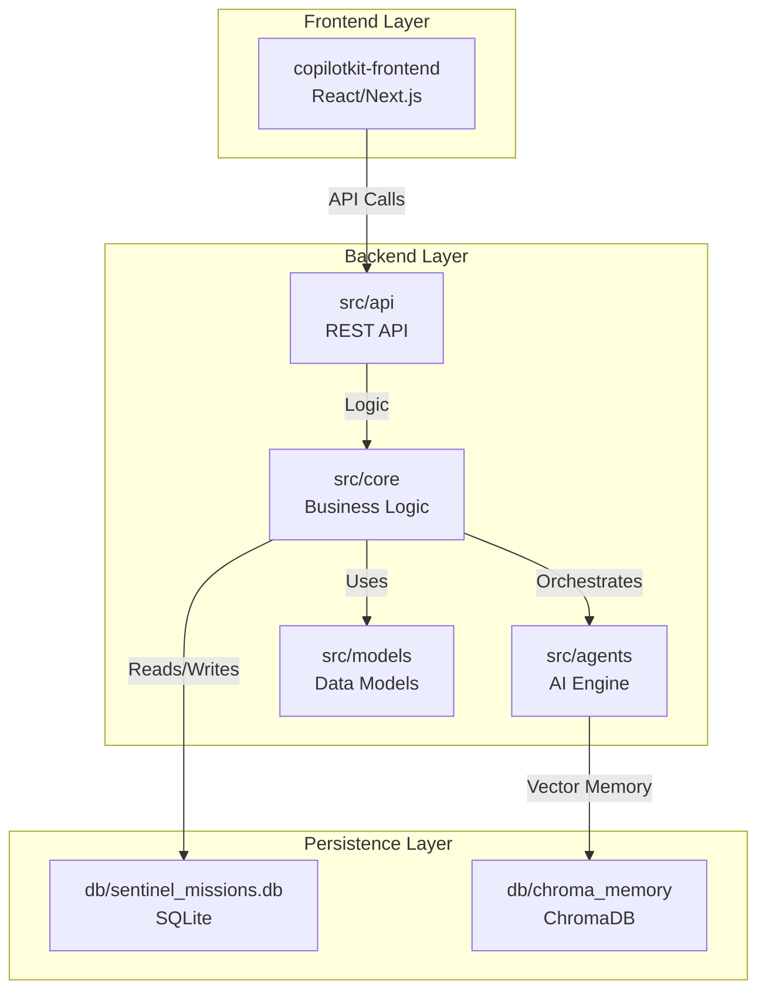

# 🚀 COPILOT SYSTEM: FULL ARCHITECTURE & DIRECTORY OVERVIEW

---

## 1. 📦 Directory Structure (Root, August 2025)

copilot/
│
This overview reflects the current, active state of your workspace. All legacy files have been excluded. This structure is based on a full scan of your workspace as of August 2025.

```
copilot/
│
├── copilotkit-frontend/         # Modern React/Next.js frontend (CopilotKit UI)
│   ├── .env                     # Frontend environment variables
│   ├── package.json             # Frontend dependencies and scripts (npm/yarn)
│   ├── README.md                # Frontend-specific documentation
│   └── src/                     # Frontend source code
│       ├── App.js / App.jsx     # Main React application component
│       ├── index.js / index.css # Entry point and global styles
│       ├── components/          # Reusable React UI components
│       ├── context/             # React context providers for global state
│       ├── hooks/               # Custom React hooks for component logic
│       ├── pages/               # Next.js page components (app routes)
│       ├── sentry.js            # Sentry integration for error tracking
│       ├── setupProxy.js        # Proxy setup for API requests in dev
│       ├── styles/              # Global/component stylesheets
│       ├── utils/               # Frontend utility functions
│       └── views/               # High-level UI views/screens
│
├── db/                          # Local database files for agent memory
│   └── chroma_memory/           # ChromaDB vector storage for agent memory
│       ├── chroma.sqlite3       # Main ChromaDB database file
│       └── a71a6ad9-.../        # ChromaDB collection data (UUID-named folders)
│
├── src/                         # Python backend source code
│   ├── __init__.py
│   ├── cognitive_engine_service.py # Core service for the cognitive/AI engine
│   ├── main.py                  # Backend entry point (FastAPI/Flask)
│   ├── observability_manager.py # Logging, tracing, metrics
│   ├── agents/                  # AI agent logic
│   │   ├── __init__.py
│   │   ├── advanced_agents.py
│   │   ├── ai_task_parser.py
│   │   ├── executable_agent.py
│   │   ├── real_mission_executor.py
│   │   └── simple_executable_agent.py
│   ├── api/                     # API endpoint definitions
│   │   ├── __init__.py
│   │   └── copilotkit.py
│   ├── config/                  # Backend config modules
│   │   ├── __init__.py
│   │   └── settings.py
│   ├── core/                    # Core business logic
│   │   ├── __init__.py
│   │   ├── advanced_intelligence.py
│   │   ├── blueprint_tasks.py
│   │   ├── cognitive_forge_engine.py
│   │   ├── enhanced_cognitive_forge_engine.py
│   │   ├── execution_workflow.py
│   │   ├── hybrid_decision_engine.py
│   │   ├── real_mission_executor.py
│   │   ├── sandbox_executor.py
│   │   ├── sentinel_multi_agent_integration.py
│   │   ├── supercharged_optimizer.py
│   │   └── supercharged_websocket_manager.py
│   ├── models/                  # Data models and DB logic
│   │   ├── __init__.py
│   │   ├── advanced_database.py
│   │   ├── fix_database_schema.py
│   │   └── fix_railway_database.py
│   ├── tools/                   # Tools and utilities for agents
│   │   ├── __init__.py
│   │   ├── advanced_tools.py
│   │   ├── file_system_tools.py
│   │   ├── simple_file_system_tools.py
│   │   └── specialized_tools.py
│   └── utils/                   # General backend utilities
│       ├── __init__.py
│       ├── agent_observability.py
│       ├── automated_debugger.py
│       ├── auto_fix.py
│       ├── crewai_bypass.py
│       ├── debug_killer.py
│       ├── debug_logger.py
│       ├── fix_ai.py
│       ├── google_ai_wrapper.py
│       ├── guardian_protocol.py
│       ├── json_parser.py
│       ├── litellm_custom_provider.py
│       ├── llm_patch.py
│       ├── log_collector.py
│       ├── manage_services.py
│       ├── onnxruntime_fix.py
│       ├── performance_optimizer.py
│       ├── phoenix_protocol.py
│       ├── self_learning_module.py
│       ├── sentry_api_client.py
│       ├── sentry_integration.py
│       ├── synapse_logging.py
│       ├── system_cheatsheet.txt
│       ├── test_mission_system.py
│       ├── test_onnxruntime_fix.py
│       ├── weave_observability.py
│       └── websocket_helpers.py
│
├── .env                         # Environment variables (API keys, DB strings) - NOT COMMITTED
├── copilotkit-references.txt    # Reference notes for CopilotKit
├── pyproject.toml               # Python project configuration (PEP 621)
├── README.md                    # This file: System overview and documentation
├── requirements.txt             # Python dependencies
├── setup.cfg                    # Configuration for Python packaging tools
├── SETUP_GUIDE.md               # Setup instructions
```
├── scripts/                     # Automation and utility scripts
│   ├── apply_websocket_fix.py   # Applies patches for WebSocket issues
│   ├── check_websocket_health.py# Monitors WebSocket connection health
│   ├── fix_database_schema.py   # Migrates or repairs the DB schema
│   ├── integration_test.py      # Runs integration tests
│   ├── manage_services.py       # Script for managing system services
│   ├── monitor_websockets.py    # Real-time WebSocket monitoring tool
│   ├── start_sentinel.bat       # Windows batch script to start the system
│   ├── start_sentinel.ps1       # PowerShell script to start the system
│   ├── start_sentinel.py        # Python script to launch the system
│   └── test_websocket.py        # Utility for testing WebSocket connections
│
├── src/                         # Python backend source code
│   ├── __init__.py              # Makes 'src' a Python package
│   ├── cognitive_engine_service.py # Core service for the cognitive/AI engine
│   ├── main.py                  # Main entry point for the backend application (e.g., FastAPI/Flask)
│   ├── observability_manager.py # Manages logging, tracing, and metrics
│   ├── agents/                  # Logic for individual AI agents
│   ├── api/                     # API endpoint definitions (FastAPI/Flask routers)
│   ├── config/                  # Backend configuration modules
│   ├── core/                    # Core business logic and services
│   ├── models/                  # Data models (e.g., SQLAlchemy ORM models)
│   ├── tools/                   # Tools and utilities used by agents or services
│   └── utils/                   # General utility functions for the backend
│
├── static/                      # Static assets served by the backend (for simple HTML/Jinja2 frontends)
│   ├── css/                     # CSS files
│   ├── fonts/                   # Font files
│   ├── images/                  # Image files
│   └── js/                      # JavaScript files
│
├── templates/                   # HTML templates (e.g., Jinja2) for the simple frontend
│   ├── ai-agents.html           # Template for the AI agents dashboard
│   ├── analytics.html           # Template for the analytics dashboard
│   ├── index.html               # Main landing page template
│   ├── missions.html            # Template for the missions dashboard
│   ├── settings.html            # Template for the settings page
│   └── test-missions.html       # Template for testing missions
│
├── tests/                       # Automated tests for the backend
│
├── workspace/                   # Directory for temporary files, agent outputs, etc.
│
├── .env                         # Environment variables (API keys, DB connection strings) - NOT COMMITTED
├── CREWAI_LLM_FIX_SUMMARY.md    # Documentation for CrewAI LLM fixes
├── CRITICAL_FIXES_SUMMARY.md    # Summary of critical system fixes
├── Dockerfile                   # Configuration for building a Docker container
├── LLM_FIX_README.md            # README for LLM-related fixes
├── README.md                    # This file: System overview and documentation
├── SENTINEL_SYSTEM_OVERVIEW.md  # High-level overview of the Sentinel system
├── SENTINEL_V6_INTEGRATION_COMPLETE.md # Notes on Sentinel v6 integration
├── SETUP_GUIDE.md               # Instructions for setting up the system
├── WEBSOCKET_DIAGNOSTIC_TOOLS.md# Documentation for WebSocket diagnostic tools
├── WEBSOCKET_FIXES_SUMMARY.md   # Summary of WebSocket-related fixes
├── copilot-integration.txt      # Notes on Copilot integration
├── copilotkit-references.txt    # References for CopilotKit
├── mission_details.json         # Example or default mission details
├── multi_agent_config.toml      # Configuration for the multi-agent system
├── pyproject.toml               # Python project configuration (PEP 621)
├── railway.toml                 # Configuration for Railway deployments
├── requirements.txt             # Python dependencies
└── setup.cfg                    # Configuration for Python packaging tools (e.g., setuptools)
```

---

## 2. 🗂️ File & Directory Explanations (In-Depth)

### `copilotkit-frontend/`
> **Purpose:** This is the main, modern user interface for the system, built with React and Next.js. It leverages the CopilotKit framework for rich, AI-powered features.
> **How it Works:** It runs as a separate Node.js process, communicating with the Python backend via the API defined in `src/api/`. It handles all user interactions, dashboard displays, and real-time updates.

### `db/`
> **Purpose:** Contains all local database files. This is crucial for development and testing without needing a cloud database.
> - `sentinel_missions.db`: A simple SQLite database for storing mission data.
> - `chroma_memory/`: A ChromaDB vector database used by AI agents to store and retrieve memories (embeddings), enabling long-term context and learning.

### `logs/`
> **Purpose:** Stores all runtime logs from the application. Essential for debugging and monitoring system health.
> - `cognitive_engine.log`: Specific logs from the core AI decision-making services.
> - `debug.log`: General-purpose debug logs.

### `scripts/`
> **Purpose:** A collection of utility scripts for system management, maintenance, and testing.
> **How it Works:** These are standalone scripts (Python, PowerShell, Batch) that can be run from the command line to perform tasks like starting services, checking health, or applying fixes.

### `src/`
> **Purpose:** The heart of the Python backend. It contains all the core logic for the application.
> **How it Works:** It runs a web server (like FastAPI or Flask) that exposes a REST API, orchestrates AI agents, interacts with the database, and manages the core business logic of the system.
> - `main.py`: The entry point that starts the backend server.
> - `agents/`: Defines the behaviors and capabilities of different AI agents.
> - `api/`: Defines the REST API endpoints that the frontend consumes.
> - `core/`: Contains the central business logic and service managers.
> - `models/`: Defines the data structures (e.g., using SQLAlchemy) that map to database tables.

### `static/` & `templates/`
> **Purpose:** These directories support a simpler, server-side rendered frontend using a Python web framework like Flask or Django. The `static` folder holds assets (CSS, JS), and `templates` holds the HTML pages.
> **Note:** This is likely a simpler or older UI. The primary, modern UI is in `copilotkit-frontend/`.

### `tests/`
> **Purpose:** Contains all automated tests for the Python backend. This ensures code quality and prevents regressions.

### `workspace/`
> **Purpose:** A temporary storage area for agents. Agents can use this directory to store intermediate files, outputs, or logs for a specific task.

### Configuration Files (`.env`, `pyproject.toml`, `multi_agent_config.toml`)
> **Purpose:** These files control the behavior of the system.
> - `.env`: Stores secrets and environment-specific settings like API keys and database URLs. It is critical that this file is **not** committed to version control.
> - `pyproject.toml`: The standard configuration file for modern Python projects. It defines dependencies, project metadata, and tool settings.
> - `multi_agent_config.toml`: A custom configuration file for defining the settings and behaviors of the multi-agent system.

### Documentation (`.md`, `.txt` files)
> **Purpose:** A rich set of Markdown and text files that document the system's architecture, setup, and development history. This `README.md` is the central document.

---

## 3. 🧠 System Logic & Data Flow

### 3.1. **Frontend-Backend Interaction**

```mermaid
flowchart LR
    A[copilotkit-frontend (React/Next.js)] -- API Request (HTTP/REST) --> B[src/ (Python Backend) (FastAPI/Flask)]
    B -- Read/Write data --> C[db/ (Databases) (SQLite & ChromaDB)]
    B -- API Response --> A
    B -- Orchestrate agent --> D[agents/, core/, tools/]
    D -- Read/Write data --> C
```
```

### 3.2. **Agent Memory Flow**

### 3.2. **Agent Memory Flow**

```mermaid
flowchart LR
    A[src/agents/ (Agent Logic)] --> B[src/tools/ (Vector DB Tool)]
    B --> C[db/chroma_memory/ (ChromaDB)]
```
```

---

## 4. 🖼️ Visual System Map

### 4. 🖼️ Visual System Map



---

### 4.1. 🛠️ CI/CD & Deployment Pipeline

```mermaid
flowchart LR
    Dev[Developer] -->|Pushes code| GitHub[GitHub Repository]
    GitHub -->|Triggers| Actions[GitHub Actions CI]
    Actions -->|Runs tests, builds Docker image| Docker[Docker Image]
    Docker -->|Pushes to| Registry[Container Registry]
    Registry -->|Deploys| Cloud[Cloud/Server (e.g., Railway, AWS, Azure)]
    Cloud -->|Runs| System[Copilot System]
```
```

---

## 5. 🛠️ Key Workflows

### 5.1. **Mission Execution**
1.  **Creation:** A user creates a new mission in the `copilotkit-frontend` UI.
2.  **API Call:** The frontend sends a request to the backend's `/api/missions` endpoint.
3.  **Storage:** The backend stores the new mission details in the `sentinel_missions.db`.
4.  **Orchestration:** The `cognitive_engine_service` picks up the mission and assigns it to an appropriate agent from `src/agents/`.
5.  **Execution:** The agent executes the task, using `src/tools/` and storing/retrieving information from `db/chroma_memory/` as needed.
6.  **Updates:** As the agent works, it sends status updates back through the backend, which are reflected in the real-time UI.
7.  **Completion:** Once the mission is complete, the final status is saved to the database.

---

## 6. 📚 Additional Notes & Insights
- **Dual Frontend:** The system appears to have two frontends: a modern, primary one in `copilotkit-frontend/` and a simpler, server-rendered one supported by `static/` and `templates/`. Understanding which one is active for development is key.
- **Configuration is King:** The system's behavior is heavily controlled by configuration files (`.env`, `.toml`). This makes it flexible but also requires careful management of settings.
- **Extensibility:** The architecture is highly modular. You can add new agents, tools, or API endpoints with minimal changes to the core system by adding files to the `src/agents`, `src/tools`, and `src/api` directories.
- **Security:** The use of a `.env` file is a good security practice. Ensure it is never committed to your Git repository. Any scripts that execute shell commands should be carefully audited to prevent security vulnerabilities.

---

# END OF OVERVIEW
